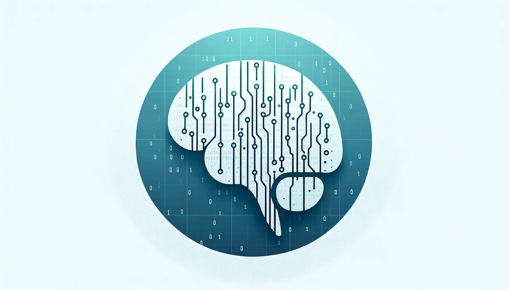

# CodeBrainWaves: Navigating Mental Health in Tech

### Analytics Report prepared by Moh Jaiswal

## Introduction

CodeBrainWaves delves into the complex interplay between technology careers and mental health, utilizing SQL to uncover patterns and insights from a 2015 survey of tech employees. This project not only highlights the prevalence of mental health issues in the tech industry but also aims to spark dialogue and drive improvements in workplace mental health policies and support systems.

## Why This Matters

Tech professionals often face unique pressures, including long hours, high stakes, and rapid change, which can impact mental well-being. CodeBrainWaves uses data to shine a light on these challenges, providing evidence-based insights that can inform better support structures in tech organizations.

## Entity-Relationship Diagram (ERD)

## Insights from the Mental Health inTech Survey

Diving into the vast sea of data from the 2015 Mental Health inTech Survey, we've unearthed some compelling narratives about the state of mental health within the tech industry. Here's a summary of our key findings:

- **The Age of Awareness:** A significant majority, **1034 respondents**, are navigating the challenges of the tech world beyond the age of 25, indicating a workforce with potentially deeper professional and life experiences.

- **Gender Diversity:** The survey showcased a spectrum of gender identities, with **32 unique entries**. While 'Male' and 'Female' emerged as the predominant categories, the diversity of gender expressions highlights the evolving understanding and inclusivity within the tech community.

- **Self-Employment and Silence:** A curious finding is the **18 instances** where respondents chose 'NA' when asked about their self-employment status, hinting at the complexity or perhaps the sensitivity around employment status in relation to mental health discussions.

- **Men Seeking Help:** Of the **989 cis males** surveyed, **446** acknowledged receiving treatment for mental health issues. This number, while significant, also points to a larger portion grappling with mental health concerns silently.

- **Canadian Women and Family History:** In Canada, **9 out of 243 women** reported a family history of mental health issues. This statistic sheds light on the genetic and environmental factors influencing mental health, particularly among women in the tech industry.

- **Senior Women Facing Challenges Alone:** Among women over 40 working in tech, only **1 reported** frequent mental health issues interfering with work. This solitary figure underscores the isolation and unique challenges faced by older women in a fast-paced and often youth-centric industry.

- **Anonymity in Seeking Help:** The quest for anonymity in seeking mental health support varied with age - **44 individuals under 25**, **303 between 26 and 49**, and a mere **7 over 50**. Notably, adjusting the age brackets slightly to include those exactly 25 or 50 years old yields **64** and **8** individuals, respectively, in those categories, with the middle group remaining constant at **303**. This suggests a cautious approach to mental health discourse, with a significant number seeking confidential avenues for support.

These insights not only highlight the prevalence and diversity of mental health issues within the tech industry but also emphasize the critical need for inclusive, supportive, and confidential mental health resources. The data paints a picture of a workforce navigating the complexities of mental well-being amid the pressures of innovation and competition, calling for a collective effort to foster a more understanding and accommodating work environment.

### **Note: For the output screenshots refer to Report.md file**

## Next Steps and Areas for Improvement

The initial analysis provides a solid foundation, but there's ample room for deeper exploration. Future directions include:

- **Longitudinal Studies**: Tracking changes over time to identify trends and evaluate the impact of industry-wide mental health initiatives.
- **Expanded Demographic Analysis**: Including more diverse populations within the tech industry to gain a broader understanding of mental health dynamics.
- **Integration of Qualitative Data**: Incorporating interviews and open-ended survey responses to enrich the quantitative analysis with personal experiences and perspectives.

## Collaborate

Your expertise can help expand this project. Fork, adjust, and submit a PR to contribute to this important conversation on mental health in tech.

## Acknowledgements

## Note

CodeBrainWaves merges technical skill with critical social analysis, aiming to bridge the gap between data and mental health advocacy in the tech industry. This project is a call to action for creating healthier, more supportive tech environments.

---

© 2024 Moh Jaiswal. Pioneering Mental Health Insights in Tech. All Rights Reserved.
