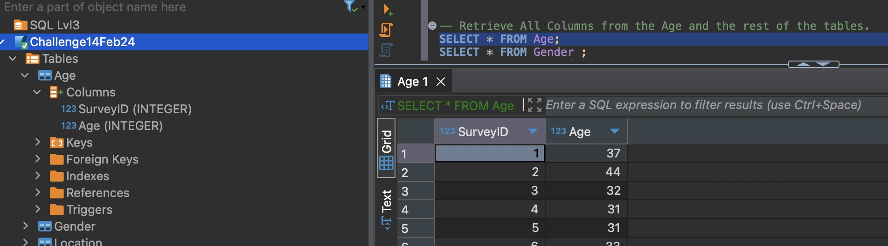
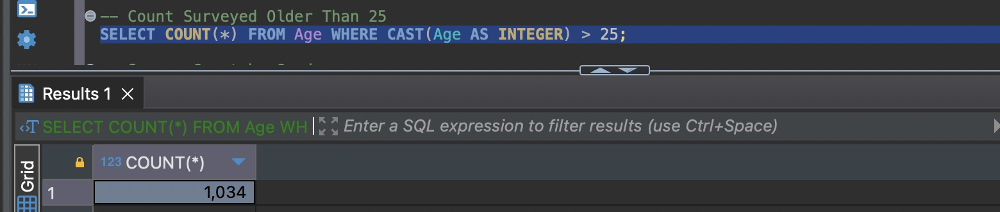
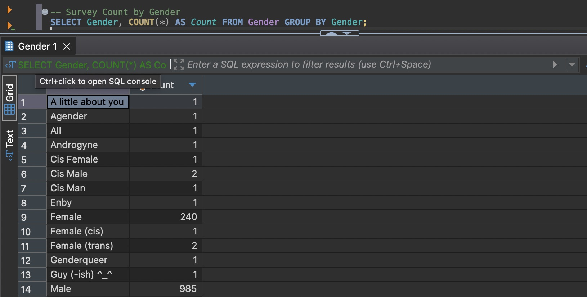
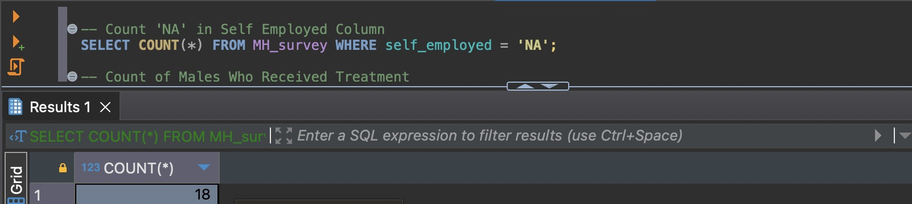
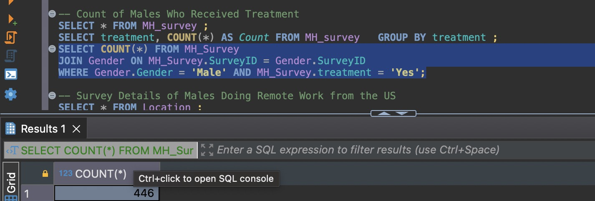
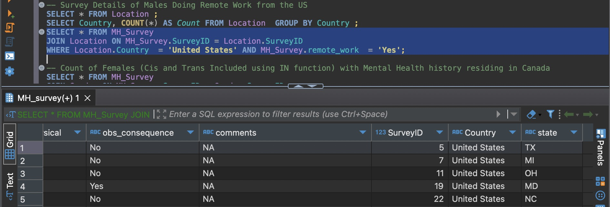
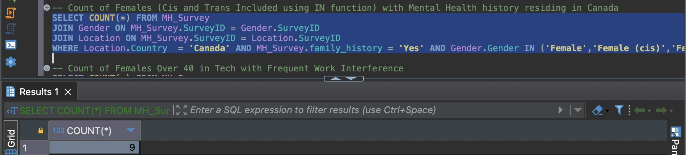
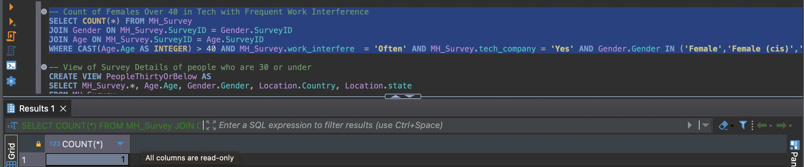
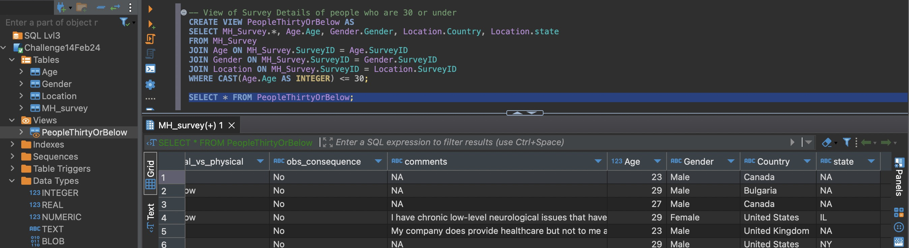
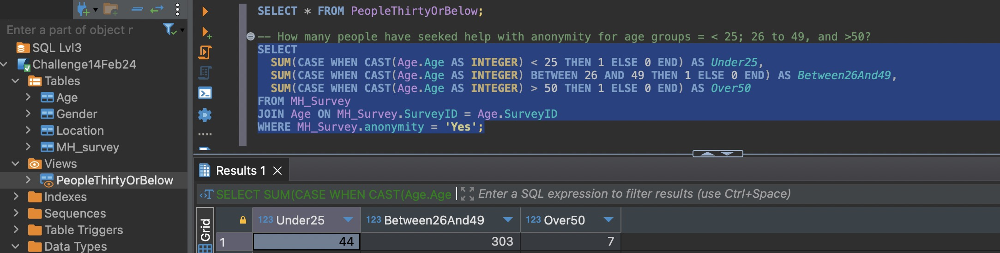

# Mental Health inTech Survey Analysis Report

## Introduction

This report provides insights into the mental health status of tech employees based on the analysis of the Mental Health inTech Survey data from 2015. The following sections detail the findings for each survey question, supported by visual evidence in the form of screenshots.

## Survey Questions and Answers

### Question 1: Retrieve All Columns from the Age Table

**Answer:**

### Question 2: How Many Surveyed Were Older Than 25?

**Answer:**

### Question 3: How Many People Were Surveyed by Gender?

**Answer:**

### Question 3: How Many People Were Surveyed by Gender?

**Answer:**

### Question 3: How Many People Were Surveyed by Gender?

**Answer:**

### Question 3: How Many People Were Surveyed by Gender?

**Answer:**

### Question 3: How Many People Were Surveyed by Gender?

**Answer:**

### Question 3: How Many People Were Surveyed by Gender?

**Answer:**

### Question 3: How Many People Were Surveyed by Gender?

**Answer:**

### Question 3: How Many People Were Surveyed by Gender?

**Answer:**

## Conclusion

(Summarize the key findings and insights from your analysis, and propose any recommendations or next steps based on your findings.)

---
